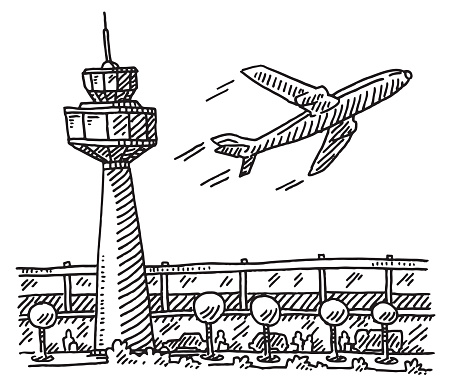

# C++ Basics

Ok! Yes, again. A crush course in C++. And nop, this repo won't have a really detailed description of everything. Just the core concepts (more precisely scripts to remember how life looks with c++ glasses. 

But sth that can't miss: The quote of this repo (which we are trying to remember a little bit more often due to our constant overwhelming overthinking :P):

<b> "Building the plane while you fly it </b>"

I mean... Just begin and let's what happens. As soon as you begin to move, the perspective will change.

And the tutorial we will follow can be found [here.](https://www.youtube.com/watch?v=vLnPwxZdW4Y)